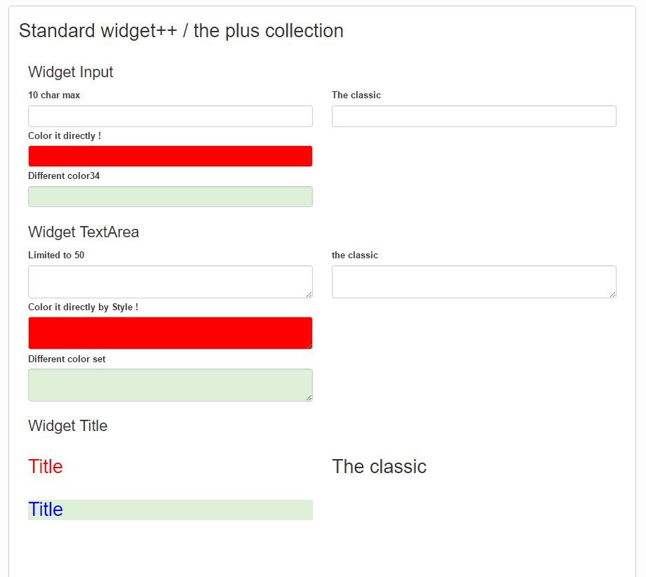

# widget_Plus

This collection is a set of widget which give more controls on the standard widget.

InputPlus : 
	* Real Max Length : you can decide for the max character. After this number, it is not possible to give more character
	* Style CSS : directly set some additional CSS style to the input
	* Title : add an info bullet to your widget
	
TextArea plus
	* Real Max Length : you can decide for the max character. After this number, it is not possible to give more character
	* Style CSS : directely set some additional CSS style to the input
	* Title : add an info bullet to your widget
	
Title Plus
	* Style CSS : directly set some additional CSS style to the input
		

	